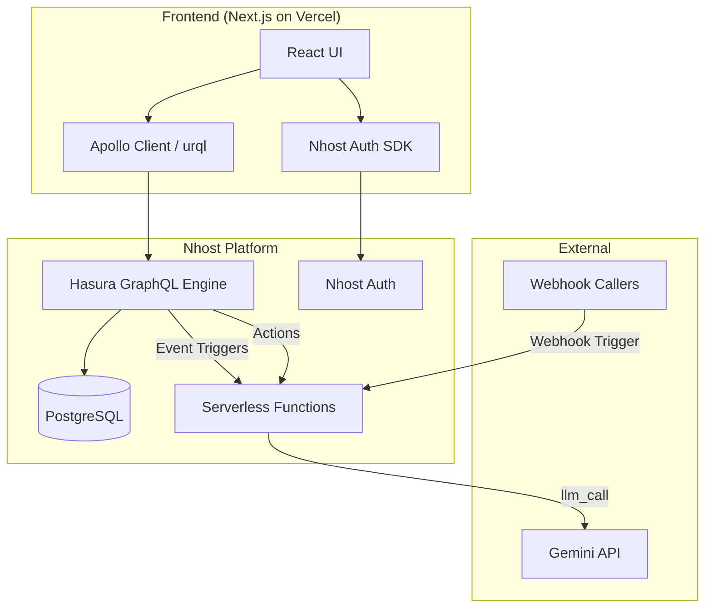

# AI Agent Workflow Builder

An open-source mini n8n/Zapier-style platform for chaining AI agent steps into automated workflows. Built with **Next.js**, **nhost** (PostgreSQL, Hasura GraphQL, Auth, Serverless Functions), and **Groq LLM API**. Features multi-tenancy with multi-organization support and role-based permissions enforced across database and application layers.

---

## Tech Stack

- **Frontend**: Next.js (App Router), React, Apollo Client (GraphQL subscriptions & queries)
- **Backend**: nhost (Hasura GraphQL Engine, PostgreSQL 14, nhost Auth, Serverless Functions)
- **LLM Engine**: Groq API or OpenRouter API
- **Deployment**: Vercel (Frontend) + nhost Cloud (Backend)

---

## Prerequisites

- **Node.js** v20+
- **Docker** installed & running (required for local nhost)
- **nhost CLI**: `npm install -g nhost`
- **API Key**: Groq API Key or OpenRouter API Key

---

## Quick Start (Local Development)

### 1. Clone & Install
```bash
git clone <repository-url>
cd <project-root>
```

### 2. Set Up nhost
```bash
npm install -g nhost    # if not already installed
nhost up                # starts Postgres, Hasura, Auth, Functions
```

### 3. Configure Environment
Add your API key to `nhost/.secrets`:
```ini
GROQ_API_KEY=your-groq-key-here
# OR
OPENROUTER_API_KEY=your-openrouter-key-here
```

Frontend env is pre-configured in `web/.env.local`.

### 4. Install & Run Frontend
```bash
cd web
npm install
npm run dev
```

### 5. Open http://localhost:3000

### 6. Register Test Users
Create accounts through the signup UI:

| Email | Password | Org | Role |
|---|---|---|---|
| `owner_a@test.com` | `Test@1234#` | Acme AI Labs | owner |
| `editor_a@test.com` | `Test@1234#` | Acme AI Labs | editor |
| `viewer_a@test.com` | `Test@1234#` | Acme AI Labs | viewer |
| `owner_b@test.com` | `Test@1234#` | Beta Corp | owner |

### 7. Apply Seed Data
In the Hasura Console SQL tab (http://localhost:9695), run the contents of `nhost/seeds/default/001_demo_data.sql`.

---

## Project Structure

```
├── nhost/                  # nhost backend configuration
│   ├── nhost.toml         # Main config
│   ├── .secrets           # Local secrets (gitignored)
│   ├── migrations/        # PostgreSQL schema migrations
│   ├── metadata/          # Hasura metadata (tables, permissions, actions, triggers)
│   └── seeds/             # Demo seed data
├── functions/              # nhost Serverless Functions
│   ├── trigger-workflow-run.ts       # Action: start workflow
│   ├── approve-step.ts               # Action: approve paused step
│   ├── webhook-trigger.ts            # Webhook endpoint
│   ├── handle-notify.ts              # Event Trigger: notifications
│   ├── handle-db-event-trigger.ts    # Event Trigger: DB changes
│   ├── handle-scheduled-trigger.ts   # Cron trigger handler
│   └── _lib/
│       ├── hasura-client.ts          # Admin GraphQL client
│       ├── step-executors.ts         # Step execution logic
│       └── workflow-engine.ts        # Core workflow engine
├── web/                    # Next.js Frontend
│   ├── src/app/           # App Router pages
│   ├── src/components/    # React components
│   └── src/lib/           # GraphQL queries & utilities
├── README.md
└── WRITEUP.md
```

---

## Step Types

| Type | Description | Restriction |
|---|---|---|
| `llm_call` | Calls Groq LLM API with retry | — |
| `http_request` | Generic HTTP call with retry | — |
| `db_write` | Saves data to database | Owner only |
| `notify` | Sends notification via Event Trigger | Owner only |
| `conditional_branch` | If/else based on previous output | — |
| `approval_gate` | Pauses run for human approval | — |

## Trigger Types

| Type | Description | Restriction |
|---|---|---|
| Manual | UI "Run" button | Owner/Editor |
| Webhook | External HTTP endpoint | Owner only to create |
| Scheduled | Cron-based | — |
| Database Event | Row change in watched_records | — |

---

## Permission Layers

**Layer 1: Hasura Row-Level Permissions** — Every table's permissions traverse relationships back to `org_members`, scoping all data to the caller's own org. Cross-org access is impossible.

**Layer 2: Action Handler Code** — Sensitive operations (adding db_write/notify steps, webhook triggers, approving steps, triggering runs) are enforced in serverless function code, not just database permissions.

---

## API Keys

- **Groq API**: Required for `llm_call` steps. Get free key at https://console.groq.com
- If no key is configured, `llm_call` steps return a descriptive error without crashing

---

# AI Agent Workflow Builder — Implementation Plan

A mini n8n for chaining AI agent steps, built on **nhost (Postgres + Hasura + Auth) + Next.js**.

---

## User Review Required

> [!IMPORTANT]
> **LLM API Choice**: The plan uses **Google Gemini** (free tier) for `llm_call` steps. If you have a different API key available (Groq, OpenRouter), let me know and I'll swap it.

> [!IMPORTANT]
> **Nhost Project**: This plan assumes we'll set up a **new nhost project** (cloud or local via CLI). Please confirm:
> 1. Do you already have an nhost account/project, or should I scaffold from scratch?
> 2. Do you want local-only development (`nhost up`) or also nhost cloud deployment?

> [!WARNING]
> **Deployment**: The assignment asks for a hosted URL. Nhost cloud provides the backend; for the Next.js frontend we'll deploy to **Vercel**. Please confirm this is acceptable.

## Open Questions

1. **Gemini API Key** — Do you have one, or should I use a stubbed LLM call with artificial delay as the assignment permits?
2. **Nhost cloud vs. local-only** — Cloud gives us a hosted backend URL; local-only means the reviewer must run Docker. Which do you prefer?
3. **Do you have Docker installed?** — Required for `nhost up` local dev.

---

## Architecture Overview



---

## Proposed Changes

### 1. Database Schema (PostgreSQL Migrations)

#### [NEW] `nhost/migrations/default/001_initial_schema/up.sql`

**Tables:**

| Table | Key Columns | Purpose |
|---|---|---|
| `organizations` | `id`, `name`, `quota_limit`, `quota_used`, `quota_period_start` | Org with usage quota |
| `org_members` | `id`, `org_id` → organizations, `user_id` → auth.users, `role` (owner/editor/viewer) | Membership + role |
| `workflows` | `id`, `org_id` → organizations, `name`, `description`, `is_active`, `created_by` | Workflow definition |
| `workflow_steps` | `id`, `workflow_id` → workflows, `step_order`, `step_type` (enum), `name`, `config` (JSONB) | Ordered steps |
| `workflow_triggers` | `id`, `workflow_id` → workflows, `trigger_type` (enum), `config` (JSONB), `is_active` | How a workflow starts |
| `workflow_runs` | `id`, `workflow_id` → workflows, `status` (pending/running/paused/completed/failed), `triggered_by`, `trigger_type`, `started_at`, `completed_at` | Execution instance |
| `step_runs` | `id`, `workflow_run_id` → workflow_runs, `workflow_step_id` → workflow_steps, `status`, `input` (JSONB), `output` (JSONB), `error`, `attempt_count`, `approved_by`, `approved_at`, `started_at`, `completed_at` | Per-step execution |

**Enums:**
- `step_type_enum`: `llm_call`, `http_request`, `db_write`, `notify`, `conditional_branch`, `approval_gate`
- `trigger_type_enum`: `manual`, `webhook`, `scheduled`, `database_event`
- `run_status_enum`: `pending`, `running`, `paused`, `completed`, `failed`
- `step_run_status_enum`: `pending`, `running`, `completed`, `failed`, `skipped`, `awaiting_approval`, `approved`
- `org_role_enum`: `owner`, `editor`, `viewer`

**Computed Field / View:**
- `v_org_usage_stats` — a Postgres view that aggregates org-level usage this month (total runs, calls used, average run duration)

**Indexes:**
- `org_members(user_id, org_id)` unique
- `workflow_steps(workflow_id, step_order)` unique  
- `workflow_runs(workflow_id, status)`
- `step_runs(workflow_run_id)`

---

### 2. Hasura Metadata — Relationships & Tracking

#### [NEW] `nhost/metadata/tables.yaml` (auto-generated via console)

**Relationships:**
```
organizations
  ├── org_members (array)
  ├── workflows (array)

org_members
  ├── organization (object → organizations)
  ├── user (object → auth.users)

workflows
  ├── organization (object → organizations)
  ├── workflow_steps (array, ordered by step_order)
  ├── workflow_triggers (array)
  ├── workflow_runs (array)

workflow_steps
  ├── workflow (object → workflows)
  ├── step_runs (array)

workflow_triggers
  ├── workflow (object → workflows)

workflow_runs
  ├── workflow (object → workflows)
  ├── step_runs (array)

step_runs
  ├── workflow_run (object → workflow_runs)
  ├── workflow_step (object → workflow_steps)
  ├── approver (object → auth.users, via approved_by)
```

---

### 3. Permission Layer 1 — Org + Role Scoping (Hasura Row Permissions)

All permission checks scope through `org_members` to ensure cross-org isolation. The key permission filter pattern:

```json
{
  "workflow": {
    "organization": {
      "org_members": {
        "user_id": { "_eq": "X-Hasura-User-Id" },
        "role": { "_in": ["owner", "editor", "viewer"] }
      }
    }
  }
}
```

| Table | Role | Select | Insert | Update | Delete |
|---|---|---|---|---|---|
| `organizations` | owner | ✅ own org | — | ✅ own org | — |
| `organizations` | editor | ✅ own org | — | — | — |
| `organizations` | viewer | ✅ own org | — | — | — |
| `org_members` | owner | ✅ own org | ✅ own org | ✅ own org | ✅ own org |
| `org_members` | editor | ✅ own org | — | — | — |
| `org_members` | viewer | ✅ own org | — | — | — |
| `workflows` | owner | ✅ own org | ✅ own org | ✅ own org | ✅ own org |
| `workflows` | editor | ✅ own org | ✅ own org | ✅ own org | — |
| `workflows` | viewer | ✅ own org | — | — | — |
| `workflow_steps` | owner | ✅ own org | ✅ all types | ✅ | ✅ |
| `workflow_steps` | editor | ✅ own org | ✅ except db_write/notify | ✅ except db_write/notify | ✅ |
| `workflow_steps` | viewer | ✅ own org | — | — | — |
| `workflow_triggers` | owner | ✅ own org | ✅ all types | ✅ | ✅ |
| `workflow_triggers` | editor | ✅ own org | ✅ except webhook | ✅ except webhook | — |
| `workflow_triggers` | viewer | ✅ own org | — | — | — |
| `workflow_runs` | owner | ✅ own org | via Action | — | — |
| `workflow_runs` | editor | ✅ own org | via Action | — | — |
| `workflow_runs` | viewer | ✅ own org | — | — | — |
| `step_runs` | owner | ✅ own org | via Action | via Action | — |
| `step_runs` | editor | ✅ own org | via Action | via Action | — |
| `step_runs` | viewer | ✅ own org | — | — | — |

> Every single row-level permission traverses `→ workflow → organization → org_members` to scope to the caller's own org. An editor in Org A **cannot** see Org B's data even by guessing IDs.

---

### 4. Permission Layer 2 — Step-Level Gating (Action Handler Logic)

Enforced **in the serverless function code**, not in Hasura permissions:

| Gate | Check | Where |
|---|---|---|
| Adding `db_write` step | Caller must be `owner` | `createWorkflow` / `updateWorkflow` mutation resolver or custom Action |
| Adding `notify` step | Caller must be `owner` | Same |
| Adding `webhook` trigger | Caller must be `owner` | Same |
| Approving `approval_gate` | Approver must be `owner` or `editor` in the workflow's org | `approveStep` Action handler |
| Triggering a run | Caller must be `owner` or `editor` | `triggerWorkflowRun` Action handler |

---

### 5. Hasura Actions

#### [NEW] Action: `triggerWorkflowRun`

```graphql
type Mutation {
  triggerWorkflowRun(workflow_id: uuid!): TriggerWorkflowRunOutput!
}

type TriggerWorkflowRunOutput {
  workflow_run_id: uuid!
  status: String!
  message: String!
}
```

**Handler** (`functions/trigger-workflow-run.ts`):
1. Extract `x-hasura-user-id` from session variables
2. Query `org_members` to verify caller is `owner` or `editor` in the workflow's org
3. Check `organizations.quota_used < organizations.quota_limit`
4. Create `workflow_run` (status: `running`)
5. Fetch `workflow_steps` ordered by `step_order`
6. Execute each step sequentially:
   - **`llm_call`**: Call Gemini API, retry once on failure
   - **`http_request`**: Call configured URL, retry once on failure
   - **`db_write`**: Execute insert/update on target table
   - **`notify`**: (handled via event trigger on step_run insert with type notify)
   - **`conditional_branch`**: Evaluate condition against previous step output, skip steps accordingly
   - **`approval_gate`**: Set step_run status to `awaiting_approval`, set workflow_run status to `paused`, **stop execution**
7. Update `step_runs` after each step (status, input, output, error, attempt_count)
8. On completion, increment `organizations.quota_used`
9. Set `workflow_run.status` to `completed` or `failed`

#### [NEW] Action: `approveStep`

```graphql
type Mutation {
  approveStep(step_run_id: uuid!): ApproveStepOutput!
}

type ApproveStepOutput {
  success: Boolean!
  message: String!
  workflow_run_id: uuid!
}
```

**Handler** (`functions/approve-step.ts`):
1. Extract `x-hasura-user-id`
2. Look up the `step_run` → `workflow_run` → `workflow` → `organization`
3. Verify the user is `owner` or `editor` in that org (Layer 2 check)
4. Update `step_run.status` to `approved`, set `approved_by`, `approved_at`
5. Set `workflow_run.status` back to `running`
6. **Resume execution** from the next step after the approval gate
7. Continue the same step execution logic as `triggerWorkflowRun`

#### [NEW] Action: `webhookTrigger`

```graphql
type Mutation {
  webhookTrigger(workflow_id: uuid!, payload: jsonb): TriggerWorkflowRunOutput!
}
```

**Handler** (`functions/webhook-trigger.ts`):
1. Validate the webhook token/secret from headers
2. Create the run and delegate to the same execution engine

---

### 6. Event Triggers

#### Notify Event Trigger
- **Table**: `step_runs`
- **Operation**: INSERT
- **Filter**: `step_type = 'notify'` (or handled in the function)
- **Webhook**: `functions/handle-notify.ts`
- Sends a Slack/email notification (or logs it for demo purposes)

#### Database Event Trigger (for workflow triggering)
- **Table**: configurable watched table
- **Operation**: INSERT/UPDATE
- **Webhook**: `functions/handle-db-event-trigger.ts`
- Starts a workflow run when a row changes in a watched table

---

### 7. Scheduled Trigger

#### [NEW] Cron Trigger via Hasura
- Configured in Hasura metadata
- Calls `functions/handle-scheduled-trigger.ts`
- Looks up workflows with `scheduled` trigger type and matching cron config
- Creates runs for matching workflows

---

### 8. GraphQL Operations (Frontend Queries)

```graphql
# Query: Org workflows with steps, triggers, and latest run
query GetOrgWorkflows($org_id: uuid!) {
  workflows(where: { org_id: { _eq: $org_id } }) {
    id, name, description, is_active
    workflow_steps(order_by: { step_order: asc }) {
      id, step_order, step_type, name, config
    }
    workflow_triggers { id, trigger_type, config, is_active }
    workflow_runs(limit: 1, order_by: { started_at: desc }) {
      id, status, started_at, completed_at
    }
  }
}

# Subscription: Live step-by-step progress
subscription WatchStepRuns($workflow_run_id: uuid!) {
  step_runs(
    where: { workflow_run_id: { _eq: $workflow_run_id } }
    order_by: { workflow_step: { step_order: asc } }
  ) {
    id, status, input, output, error, attempt_count
    approved_by, approved_at, started_at, completed_at
    workflow_step { step_order, step_type, name }
  }
}
```

---

### 9. Frontend (Next.js)

#### Project Structure
```
app/
├── layout.tsx              — Root layout with Nhost provider
├── page.tsx                — Landing / redirect
├── login/page.tsx          — Auth page (nhost sign-in/up)
├── dashboard/
│   ├── layout.tsx          — Org context selector, sidebar
│   ├── page.tsx            — Dashboard home (workflows list, usage)
│   ├── workflows/
│   │   ├── page.tsx        — Workflow list
│   │   ├── [id]/page.tsx   — Workflow builder (add/reorder steps, triggers)
│   │   └── new/page.tsx    — Create new workflow
│   └── runs/
│       └── [id]/page.tsx   — Live run viewer (subscription-powered)
├── components/
│   ├── WorkflowBuilder.tsx — Drag-and-drop step editor
│   ├── StepCard.tsx        — Individual step configuration
│   ├── TriggerConfig.tsx   — Trigger type selection + config
│   ├── RunViewer.tsx       — Live step-by-step progress
│   ├── ApprovalDialog.tsx  — Approve/reject for approval_gate
│   ├── UsageIndicator.tsx  — Quota bar
│   ├── OrgSwitcher.tsx     — Switch between orgs
│   └── Sidebar.tsx         — Navigation
├── lib/
│   ├── nhost.ts            — Nhost client config
│   ├── GraphQL/             — Query/mutation/subscription definitions
│   └── utils.ts
└── styles/
    └── globals.css         — Design system
```

#### Key UI Features
1. **Auth**: Login/signup via Nhost SDK (`@nhost/nextjs`)
2. **Org Context**: Org switcher in sidebar, all queries scoped to selected org
3. **Workflow Builder**: Visual step list with drag-to-reorder, step type picker, JSONB config editors
4. **Run Button**: Visible only for owner/editor; calls `triggerWorkflowRun` Action
5. **Live Run Viewer**: GraphQL subscription on `step_runs`, real-time status badges, animated progress
6. **Approval UI**: When a step is `awaiting_approval`, show an "Approve" button (owner/editor only)
7. **Usage Indicator**: Shows `quota_used / quota_limit` with a progress bar

#### Design System
- **Dark mode** with glassmorphism cards
- **Google Font**: Inter
- **Color palette**: Deep navy background, electric blue accents, gradient highlights
- **Micro-animations**: Step status transitions, progress pulses, hover effects
- **Responsive**: Works on desktop and tablet

---

### 10. Nhost Serverless Functions

#### [NEW] `functions/trigger-workflow-run.ts`
Core workflow execution engine (described in section 5)

#### [NEW] `functions/approve-step.ts`
Approval gate handler (described in section 5)

#### [NEW] `functions/webhook-trigger.ts`
Inbound webhook endpoint for external systems

#### [NEW] `functions/handle-notify.ts`
Event trigger handler for notify steps

#### [NEW] `functions/handle-db-event-trigger.ts`
Event trigger handler for database-event workflow triggers

#### [NEW] `functions/handle-scheduled-trigger.ts`
Cron trigger handler for scheduled workflows

#### [NEW] `functions/_lib/workflow-engine.ts`
Shared workflow execution logic used by trigger-workflow-run, approve-step, and webhook-trigger

#### [NEW] `functions/_lib/step-executors.ts`
Individual step type executors (llm_call, http_request, db_write, conditional_branch)

#### [NEW] `functions/_lib/hasura-client.ts`
Admin-secret authenticated GraphQL client for server-side operations

---

### 11. Seed Data

#### [NEW] `nhost/seeds/default/001_demo_data.sql`

- **Org A** ("Acme AI Labs") with quota 100
- **Org B** ("Beta Corp") with quota 50
- Users: `owner_a@test.com` (owner of Org A), `editor_a@test.com` (editor of Org A), `viewer_a@test.com` (viewer of Org A), `owner_b@test.com` (owner of Org B)
- A demo workflow in Org A with llm_call → conditional_branch → http_request → approval_gate steps
- A webhook trigger attached to the demo workflow

---

### 12. Documentation

#### [NEW] `README.md`
Setup instructions, env vars, how to run locally, architecture overview

#### [NEW] `WRITEUP.md`
~1 page covering:
- Schema reasoning and design decisions
- How the two permission layers are enforced differently (Hasura row perms vs Action handler code)
- How approval-gate pause/resume works

---

## Verification Plan

### Automated Tests
```bash
# Run the Next.js build to verify no compilation errors
npm run build

# Verify nhost services start correctly
nhost up
```

### Manual Verification — Final Task Scenario
All six checkpoints must pass in a live walkthrough:

1. **Two orgs exist** — Org A and Org B, each with distinct users and roles
2. **Org A owner builds workflow** — 3+ step types including `llm_call`, `http_request`, `conditional_branch`
3. **Two trigger methods** — Manual "Run" button + webhook trigger both start the workflow
4. **Approval gate** — Run pauses at `approval_gate`, only owner/editor in Org A can approve
5. **Live subscription** — Step-by-step status streams without refresh, including paused state
6. **Cross-org isolation** — Logged in as Org B user, cannot see/trigger/approve Org A's workflows (even via direct ID)

### Permission Verification
- Query Org A workflows as Org B user → returns empty
- Attempt `triggerWorkflowRun` with Org B user on Org A workflow → rejected
- Attempt `approveStep` with Org B user on Org A's paused step → rejected
- Viewer attempts to trigger run → rejected
- Editor attempts to add `db_write` step → rejected by Layer 2
